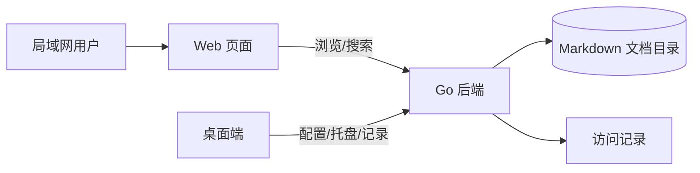

# DocShare · MD 文档中心

> 简约、现代的局域网 Markdown 文档预览工具。

DocShare 是一款前后端分离的 MD 文档浏览软件：

- **后端**：Go 编写，指定一个文档目录即可对外发布浏览；
- **前端**：纯静态页面（HTML/CSS/JS），通过 REST API 与后端通信；
- **只读**：所有访客仅可浏览文档，无任何编辑入口。

## 功能特性

- 📂 **文档树浏览** —— 自动扫描目录，支持多级文件夹、搜索过滤（`Ctrl+K`）
- 🔍 **全文搜索** —— 支持中文与英文关键词，结果带上下文摘要与高亮
- 📝 **Markdown 渲染** —— GFM 语法、代码高亮（一键复制）、Mermaid 图表、任务列表、表格
- 📑 **悬浮大纲** —— 章节导航，点击跳转，滚动同步高亮
- 📊 **访问记录** —— 桌面端聚合查看最近 200 条浏览记录（时间/文档/来源 IP）
- 🌗 **双主题** —— 深浅配色全局平滑渐变，自动记忆偏好

## 架构图



## 快速开始

### 桌面版(推荐)

双击运行 `DocShare.exe`，在「设置」中选择本文档目录即可；最小化/关闭窗口会隐藏到系统托盘，右键托盘图标可打开或退出。

### 服务器版

```bash
DocShare-Server.exe -dir ../docs -addr 0.0.0.0:8080
```

启动后控制台会打印本机与局域网访问地址：

```text
本机访问:   http://localhost:8080
局域网访问: http://192.168.x.x:8080
```

### 访问

- 同一局域网内的设备（手机、平板、其他电脑）直接访问 `http://<服务端IP>:8080` 即可浏览文档。

## 命令行参数

| 参数 | 默认值 | 说明 |
| ---- | ------ | ---- |
| `-dir` | `docs` | Markdown 文档根目录 |
| `-addr` | `0.0.0.0:8080` | HTTP 监听地址（`0.0.0.0` 允许局域网访问） |
| `-data` | `data` | 数据目录（访问记录存档） |
| `-front` | `frontend` | 前端静态资源目录 |
| `-blacklist` | 空 | IP 黑名单（精确 IP 或 CIDR，逗号分隔） |

## 项目结构

```text
DocShare/
├── backend/               # Go 后端
│   ├── main.go            # 入口: 参数解析、启动
│   ├── go.mod
│   └── internal/
│       ├── api/           # HTTP 接口与路由
│       └── store/         # 目录树、文档读取、申请存档
├── frontend/              # 前端静态页面(分离部署)
│   ├── index.html
│   ├── css/style.css
│   ├── js/app.js
│   └── vendor/            # 本地化依赖(marked/DOMPurify/highlight.js)
└── docs/                  # 默认文档目录(可换成你自己的)
```

## API 一览

| 方法 | 路径 | 说明 |
| ---- | ---- | ---- |
| GET | `/api/tree` | 文档目录树 |
| GET | `/api/doc?path=xxx` | 读取文档原始内容 |
| GET | `/api/health` | 健康检查 |

## 安全说明

- 所有文档路径均经过**目录穿越防护**（含符号链接逃逸校验），只能访问文档根目录内的 `.md` 文件；
- 前端渲染经过 DOMPurify 消毒，防止 XSS；
- 支持 IP 黑名单（精确 IP / CIDR），命中即拒绝访问。

## 技术栈

| 层 | 技术 |
| -- | ---- |
| 后端 | Go (标准库 net/http) |
| 前端 | 原生 HTML/CSS/JS + marked + DOMPurify + highlight.js |
| 通信 | REST API (JSON) |

服务端以 Go `net/http` 为主，Windows 目录监听使用 `golang.org/x/sys`；依赖由 Go Modules 锁定。
